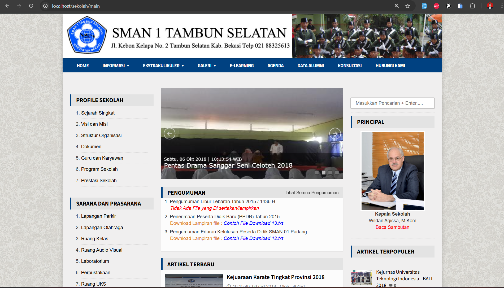
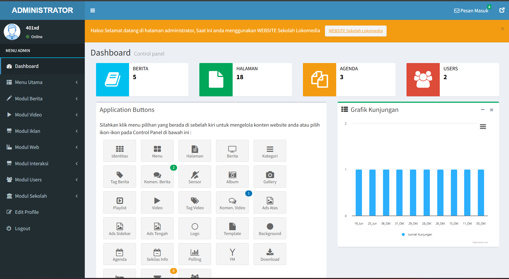
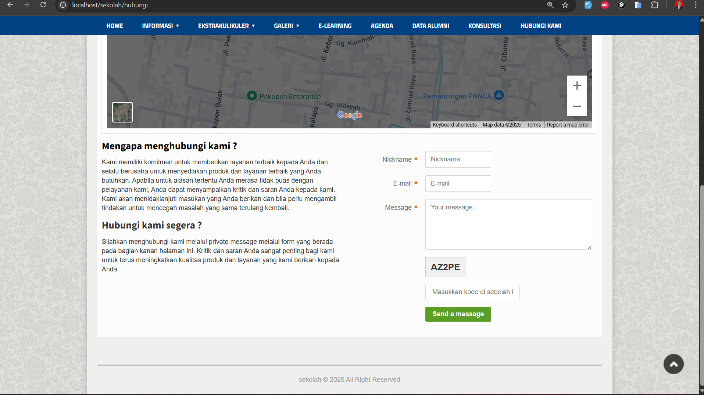

# Portal Sekolah

Portal Sekolah adalah aplikasi web berbasis CodeIgniter yang dirancang untuk memudahkan pengelolaan informasi dan konten sekolah secara online. Aplikasi ini menyediakan berbagai fitur untuk menampilkan informasi sekolah, berita, agenda, galeri, video, dan lainnya.

## Fitur Utama

### 1. Manajemen Berita
- Publikasi berita terbaru sekolah
- Kategorisasi berita
- Pencarian berita berdasarkan kata kunci
- Tampilan detail berita dengan komentar

### 2. Manajemen Agenda
- Publikasi agenda kegiatan sekolah
- Informasi detail agenda (tanggal, waktu, tempat, deskripsi)
- Tampilan kalender agenda

### 3. Galeri Foto
- Pengelolaan album foto
- Upload dan tampilan galeri foto kegiatan sekolah
- Tampilan slideshow foto

### 4. Manajemen Video
- Pengelolaan playlist video
- Upload dan tampilan video kegiatan sekolah
- Integrasi dengan platform video eksternal

### 5. Pengumuman
- Publikasi pengumuman penting
- Lampiran file untuk diunduh
- Notifikasi pengumuman terbaru

### 6. Halaman Download
- Penyediaan file-file untuk diunduh (materi, dokumen, formulir)
- Kategorisasi file download
- Penghitungan jumlah unduhan

### 7. Halaman Kontak
- Form kontak dengan validasi
- Captcha untuk keamanan
- Peta lokasi sekolah terintegrasi

### 8. Panel Admin
- Manajemen pengguna dengan level akses berbeda
- Dashboard admin untuk monitoring
- Pengelolaan semua konten website
- Editor WYSIWYG untuk konten

## Teknologi yang Digunakan

- **Framework**: CodeIgniter 3
- **Database**: MySQL
- **Frontend**: HTML, CSS, JavaScript, jQuery
- **Editor**: CKEditor
- **File Manager**: KCFinder
- **Captcha**: CodeIgniter Captcha Helper

## Tampilan Aplikasi

### Halaman Utama

### Halaman Admin

### Halaman Kontak

## Keamanan

Aplikasi ini dilengkapi dengan fitur keamanan seperti:
- Enkripsi password menggunakan hash SHA-512 dan MD5
- Validasi input untuk mencegah SQL Injection
- Captcha pada form kontak dan komentar
- Pembatasan akses berdasarkan level pengguna

## Instalasi

1. Ekstrak file ke direktori web server (htdocs untuk XAMPP)
2. Buat database baru dan import file SQL dari folder DATABASE
3. Konfigurasi koneksi database di application/config/database.php
4. Akses aplikasi melalui browser

## Login Admin

- URL: http://localhost/sekolah/administrator
- Username: admin
- Password: admin

## Persyaratan Sistem

- PHP 5.6 atau lebih tinggi
- MySQL 5.0 atau lebih tinggi
- GD Library untuk fitur captcha
- mod_rewrite diaktifkan (untuk URL yang bersih)

## Pengembangan

Aplikasi ini dapat dikembangkan lebih lanjut dengan menambahkan fitur-fitur seperti:
- Sistem e-learning
- Manajemen perpustakaan
- Sistem informasi akademik
- Integrasi dengan media sosial

## Lisensi

Aplikasi ini bersifat open source dan dapat digunakan untuk keperluan pendidikan.